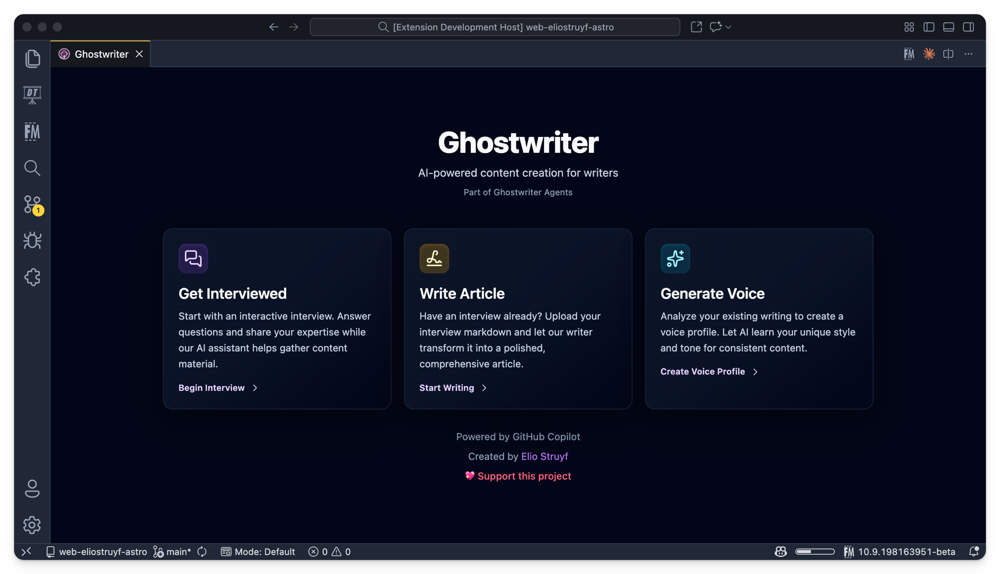
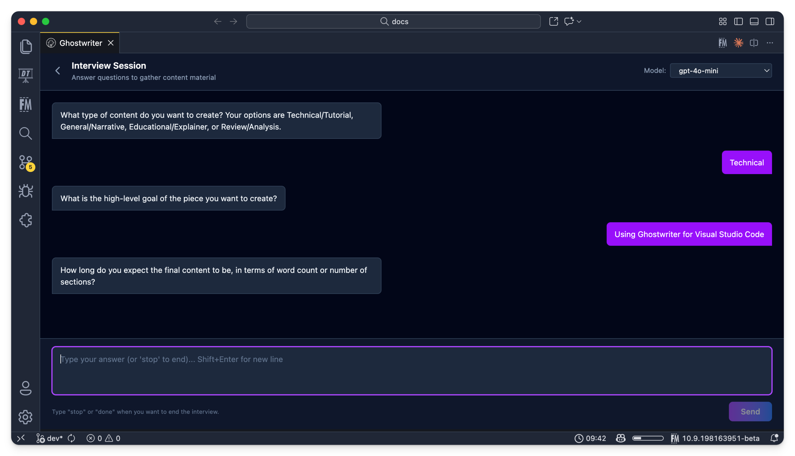
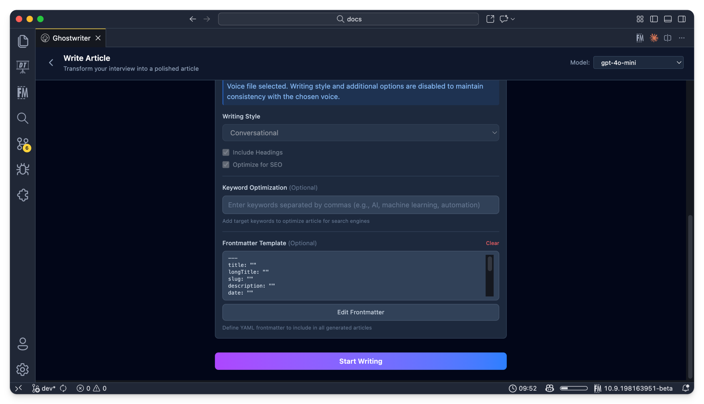
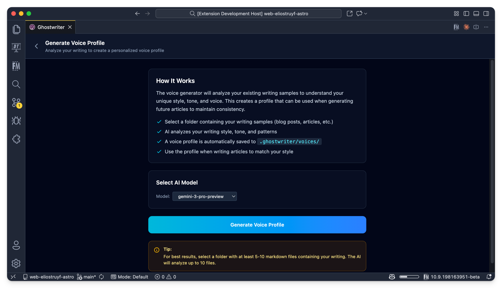

<h1 align="center">
  
</h1>

# Ghostwriter for VS Code

AI-assisted content creation tool powered by GitHub Copilot for interviews and
writing workflows. This extension provides an in-editor experience for
conducting AI-driven interviews and generating polished articles from
transcripts.

## Screenshots

<div align="center">

### Home View


### Interview Mode


### Writer Mode


### Voice Generator Mode


</div>

## Features

### AI-Powered Interview Mode
- **Interactive AI Interviews**: Conduct dynamic interviews with GitHub Copilot
  asking relevant questions
- **Smart Conversation Flow**: AI adapts questions based on your responses
- **Auto-completion Detection**: Automatically detects when the interview is
  complete
- **Model Selection**: Choose from available GitHub Copilot models (GPT-4o,
  GPT-4o mini, etc.)
- **Interviewer Agents**: Create, manage, and select custom interviewer prompts
  stored in `.ghostwriter/interviewer`
- **Transcript Management**: Automatically saves formatted transcripts to the
  `.ghostwriter` folder
- **Hot Module Replacement**: Fast development with HMR support

### Advanced Writer Mode
- **Transcript Selection**: Browse interview transcripts from your workspace or
  select custom files
- **Voice File Integration**: Apply writing style from voice files for
  consistent tone
- **Model Selection**: Choose specific GitHub Copilot models for content
  generation
- **Writer Agents**: Create, manage, and select custom writer prompts stored in
  `.ghostwriter/writer`
- **Writing Style Options**:
  - Formal, Casual, or Conversational tone
  - Automatic heading generation
  - SEO optimization
- **Keyword Optimization**: Define target keywords for improved search engine
  visibility
- **Frontmatter Templates**: Create reusable YAML frontmatter templates for
  consistent article metadata
- **Real-time Streaming**: Watch your article being generated in real-time
- **Direct File Save**: Save generated articles directly to your workspace

### Voice Generator Mode
- **Writing Style Analysis**: Automatically analyze your existing writing to
  create a personalized voice profile
- **Smart Content Discovery**: Recursively searches for markdown files in your
  selected folder
- **Recent Content Priority**: Analyzes your most recent writing (up to 20
  files) to capture your current style
- **Comprehensive Voice Profile**: Generates detailed analysis including:
  - Voice characteristics (tone, pacing, formality)
  - Style rules and guidelines
  - Lexicon (favorite phrases, words to avoid)
  - Structure patterns
- **Automatic Storage**: Voice profiles saved to `.ghostwriter/voices/` folder
- **Easy Integration**: Use generated voice files in Writer mode for consistent
  content

### State Persistence
- **Model Preferences**: Selected GitHub Copilot model persists across sessions
- **Frontmatter Templates**: Save and reuse frontmatter templates for all
  articles
- **Agent Selection**: Selected interviewer and writer agents persist across
  sessions
- **Prompt Configuration**: Selected prompt configuration persists across
  sessions

## Getting Started

1. Install the extension
2. Ensure you have GitHub Copilot subscription and extension installed
3. Open a workspace folder in VS Code
4. Use the Command Palette (`Cmd+Shift+P` / `Ctrl+Shift+P`) and run
   `Ghostwriter: Open Ghostwriter`
5. Choose between Interview, Writer, or Voice Generator mode

## Usage

### Conducting an AI Interview

1. Open the Ghostwriter panel
2. Click on "Start Interview"
3. (Optional) Select or create an interviewer agent to shape the interview
4. Select your preferred GitHub Copilot model
5. Answer the AI's questions in the chat interface
6. The AI will automatically detect completion and generate a formatted
  transcript
7. Transcript is saved to `.ghostwriter/transcripts/` folder

### Generating Content from Transcripts

1. Open the Ghostwriter panel
2. Click on "Write Article"
3. (Optional) Select or create a writer agent to guide generation
4. Select a transcript from your workspace or browse for a custom file
5. (Optional) Select a voice file to maintain consistent writing style
6. Configure writing options:
  - Choose writing style (Formal/Casual/Conversational)
  - Enable/disable headings and SEO optimization
  - Add target keywords for SEO
  - Configure frontmatter template
7. Select your preferred GitHub Copilot model
8. Click "Start Writing"
9. Watch the article generate in real-time
10. Save the article to your workspace

### Setting Up Frontmatter Templates

1. In the Writer view, expand "Writing Options"
2. Click "Add Frontmatter Template"
3. Enter your YAML frontmatter template:
   ```yaml
   ---
   title: ""
   date: ""
   tags: []
   draft: false
   ---
   ```
4. Click "Save Template"
5. The template will be applied to all future articles

### Generating a Voice Profile

1. Open the Ghostwriter panel
2. Click on "Generate Voice"
3. Select your preferred GitHub Copilot model
4. Click "Generate Voice Profile"
5. Select a folder containing your writing samples (blog posts, articles, etc.)
6. Wait for the AI to analyze your writing style
7. Voice profile is automatically saved to
   `.ghostwriter/voices/voice-YYYY-MM-DD.md`
8. Review and customize the generated profile if needed
9. Use the voice file in Writer mode to maintain your unique style

## File Structure

The extension creates a `.ghostwriter` folder in your workspace root:
```
.ghostwriter/
├── transcripts/     # Interview transcripts (.md files)
├── voices/          # Voice files for writing style (.md files)
├── interviewer/     # Interviewer agents (.md files)
└── writer/          # Writer agents (.md files)
```

## Commands

- `Ghostwriter: Open Ghostwriter` - Open the main editor panel

## Requirements

- VS Code 1.108.1 or higher
- GitHub Copilot subscription
- GitHub Copilot extension installed
- An open workspace folder

## Extension Settings

This extension stores the following in workspace state:
- Selected GitHub Copilot model ID
- Frontmatter template for articles

## Development

### Building
- `npm run compile` - Compile TypeScript
- `npm run watch` - Watch mode for TypeScript
- `npm run build:webview` - Build webview with Vite
- `npm run dev` - Start Vite dev server with HMR
- `npm run clean` - Remove build artifacts

## Contributing

This extension is part of the Ghostwriter ecosystem:
- [ghostwriter-app](https://github.com/estruyf/ghostwriter-app) - Electron app
- [ghostwriter-agents-ai](https://github.com/estruyf/ghostwriter-agents-ai) - AI
  agent services

## License

This project is licensed under the MIT License - see the [LICENSE](LICENSE) file
for details.

<p align="center">
  <a href="https://github.com/sponsors/estruyf" title="Sponsor Elio Struyf" target="_blank">
    
  </a>
</p>

<br />

<p align="center">
  <a href="https://visitorbadge.io/status?path=https%3A%2F%2Fgithub.com%2Festruyf%2Fvscode-ghostwriter">
    
  </a>
</p>

<br />

<p align="center">
  <a href="https://struyfconsulting.com" title="Hire Elio Struyf via Struyf Consulting" target="_blank">
    
  </a>
</p>


**Enjoy writing with Ghostwriter and GitHub Copilot!**
